# Unit-7-Looking-for-Suspicious-Transactions
## Background
Fraud is prevalent these days, whether you are a small taco shop or a large international business. While there are emerging technologies that employ machine learning and artificial intelligence to detect fraud, many instances of fraud detection still require strong data analytics to find abnormal charges.

I have applied my SQL skills to analyze historical credit card transactions and consumption patterns in order to identify possible fraudulent transactions.

I will accomplish three main tasks:

1. Data Modeling:
Define a database model to store the credit card transactions data and create a new PostgreSQL database using my model.

2. Data Engineering: 
Create a database schema on PostgreSQL and populate my  database from the CSV files provided.

3. Data Analysis: 
Analyze the data to identify possible fraudulent transactions trends data, and develop a report of my observations.

## Entity Relationship Diagram (ERD)
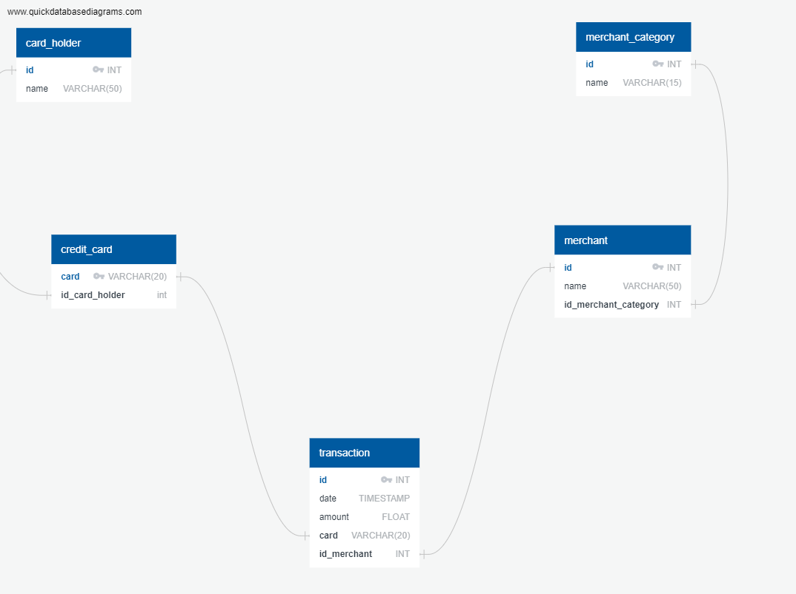

## Report

### Part 1:
The CFO of my firm has requested a report to help analyze potential fraudulent transactions. Some fraudsters hack a credit card by making several small transactions (generally less than $2.00), which are typically ignored by cardholders.

After grouping the transactions by each cardholder, and counting the transactions that are less than $2.00 per cardholder, some card holders have greater number of transactions under two dollars, but that can be due to they have more cards as well. 

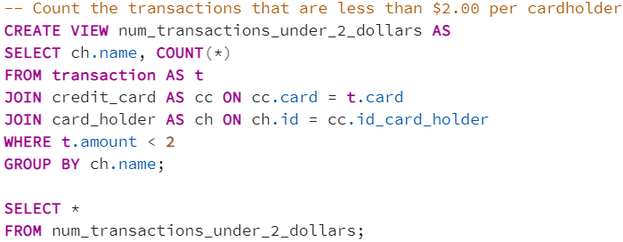

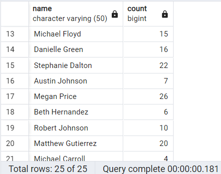

So I conducted a further investigation on grouping the result by each card, I found that the numbers of transactions under 2 dollars on each card are quite normally distributed, thus there is not much evidence to suggest that a credit card has been hacked.

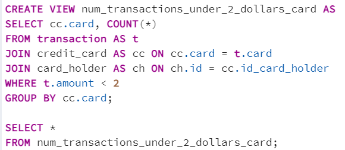

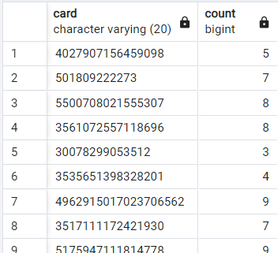

Next, I took my investigation a step futher by considering the time period in which potentially fraudulent transactions are made.

I pulled out the top 100 highest transactions made between 7:00 am and 9:00 am, there are some anomalous transactions, which are under two dollars, that could be fraudulent.

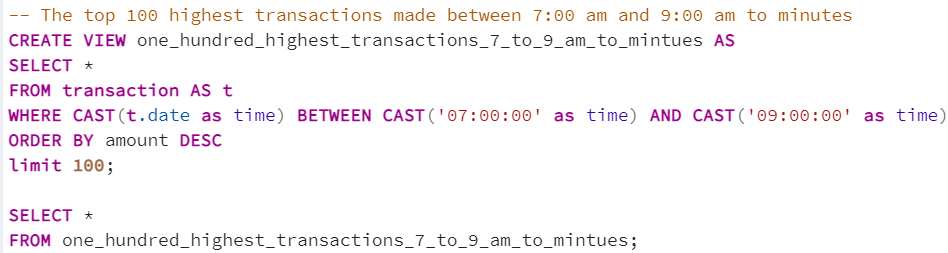

To test the hypothesis of whether there is a higher number of fraudulent transactions made during this time frame versus the rest of the day, I then counted the number of anomalous transactions that could be fraudulent during 7 am to 9am, there are 30 of them.

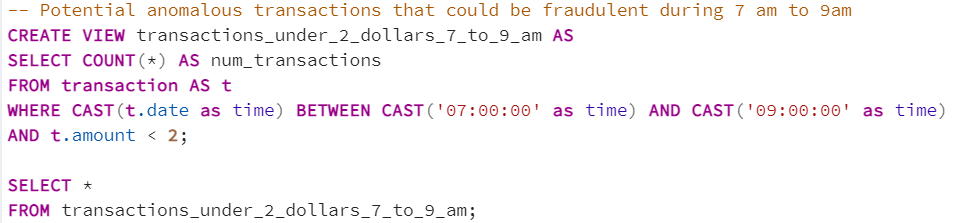

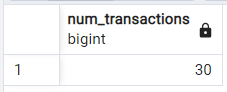

In comparison, there are 320 anomalous transactions happened during the rest of the day. So on average, there are 15 fraudulent transactions per hour during 7 am to 9 am; whereas there are 14.55 fraudulent transactions per hour during the rest of the day. 

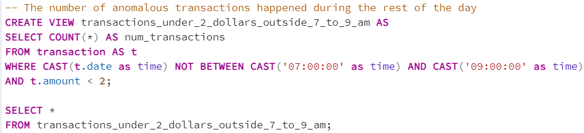

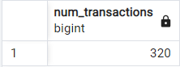

To conclude, the number of fraudulent transactions are not significantly higher during 7 am to 9 am comparing to the rest of the day.

In addition, the sql query I wrote to find out the top 5 merchants prone to being hacked using small transactions and the result are shown in the picture below:

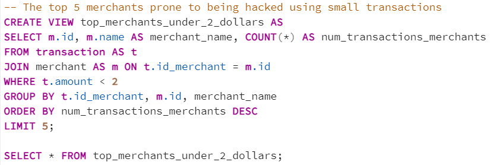

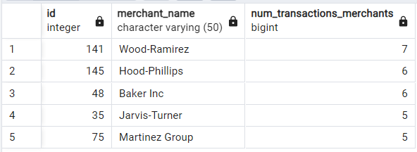

### Part 2:
My CFO has also requested detailed trends data on specific card holders. I have queried the database using python in Jupyter Notebook and generate visualizations that supply the requested information as follows:

The two most important customers of the firm may have been hacked. To verify if there are any fraudulent transactions in their history. For privacy reasons, I only know that their cardholder IDs are 2 and 18.

Using hvPlot, I have created a line plot representing the time series of transactions over the course of the year for each cardholder separately.

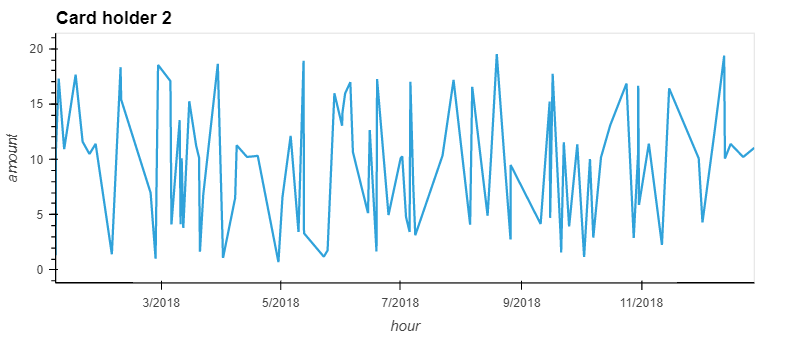

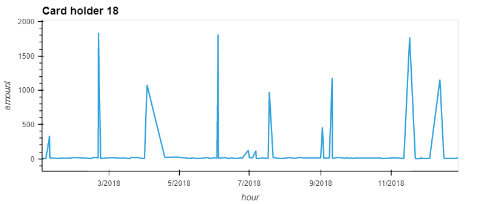

Next, to better compare their patterns, I have created a single line plot that contains both card holders' trend data.

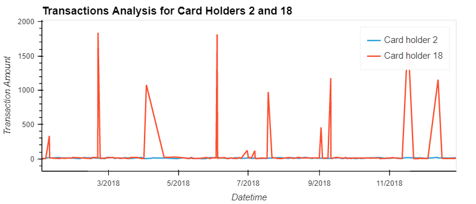

We can see that there are some unusual spikes in Card holder 18's transactions comparing to Card Holder 2's trend of transactions. These spikes break Card holder 18's usual consumption patterns, thus it is likely to suggest fraudulent transactions might happened with Card holder 18's cards. We will need to further investigate their transactions.

The CEO of the biggest customer of the firm suspects that someone has used her corporate credit card without authorization in the first quarter of 2018 to pay quite expensive restaurant bills. Again, for privacy reasons, I know only that the cardholder ID in question is 25.

Using hvPlot, I have created a box plot, representing the expenditure data from January 2018 to June 2018 for cardholder ID 25.

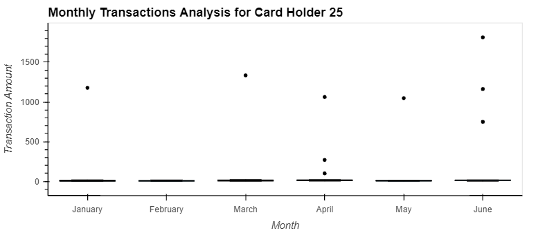

Based on the box plots on card holder 25's transactions, we can see that the dots on the graphs are the outliers, they are anomalies.There is one outlier in January, one outlier in March, three outliers in April, one outlier in May and three outliers in June.

As the CEO suspects someone has used her corporate credit card without authorization in the first quarter of 2018 to pay quite expensive restaurant bills, we will need to further investigate the two anomolies in January and March of 2018 in particular.

## Challenge
Another approach to identifying fraudulent transactions is to look for outliers in the data. Standard deviation or quartiles are often used to detect outliers.

I have coded two Python functions:

One that uses standard deviation to identify anomalies for any cardholder:

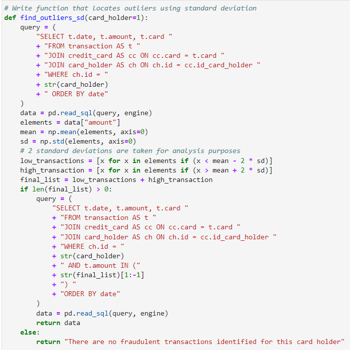

And the results from finding anomalous transactions for 3 random card holders using `Standard Deviation` are as follow:

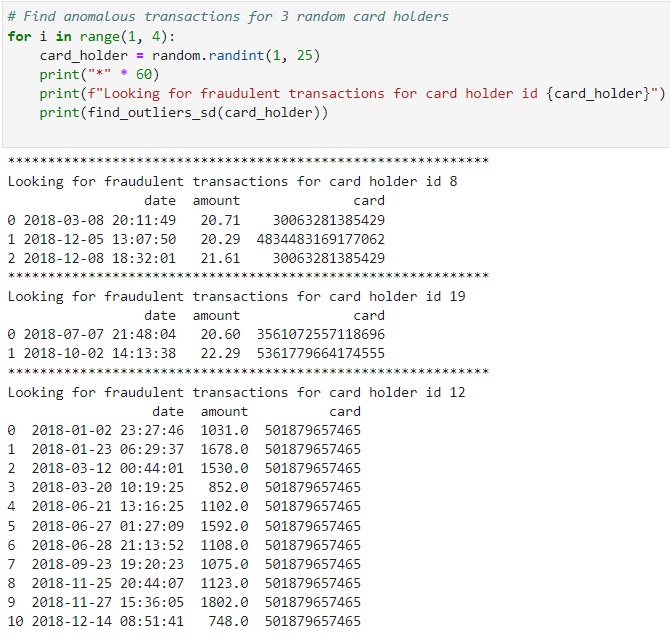

Another that uses interquartile range to identify anomalies for any cardholder:

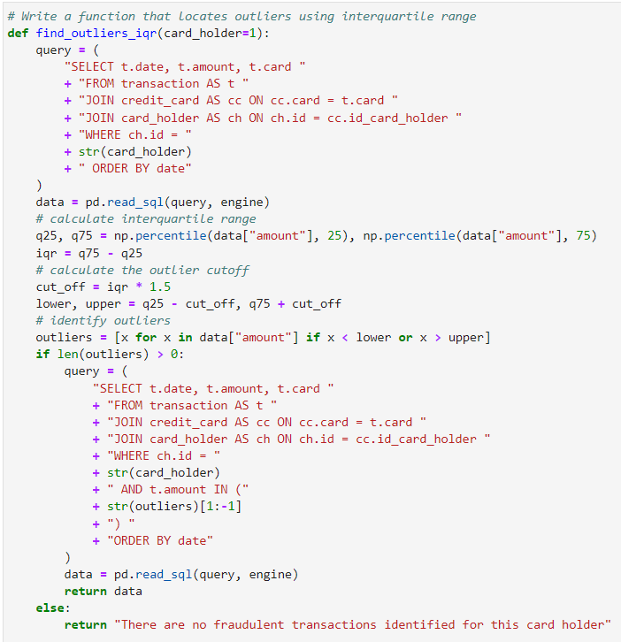

And the results from finding anomalous transactions for 3 random card holders using `Interquartile Range` are as follow:

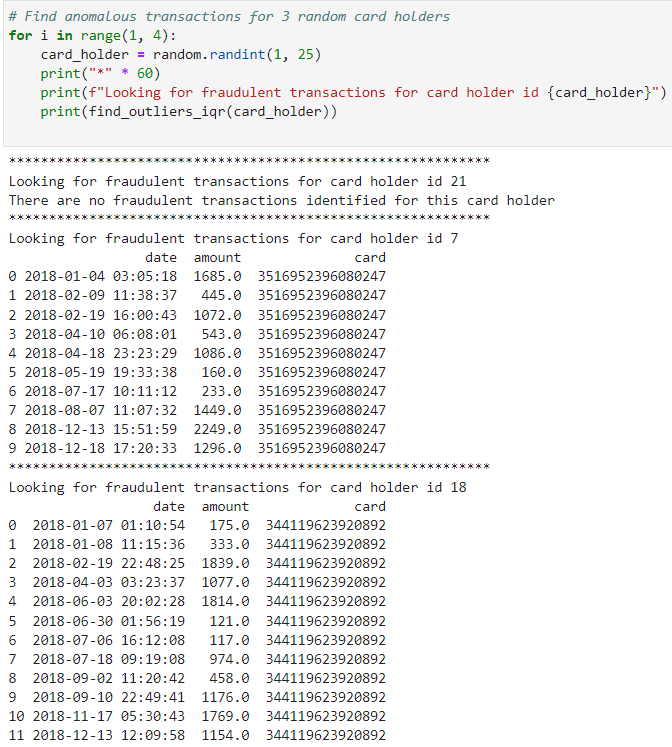